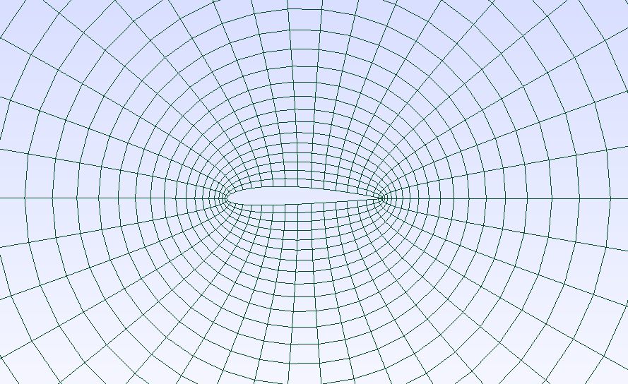
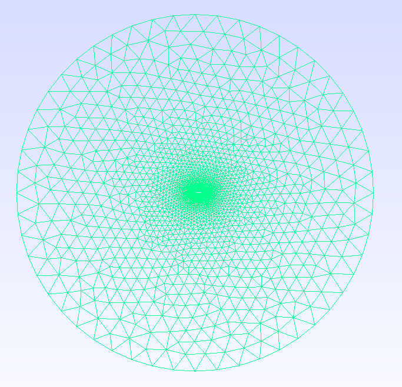
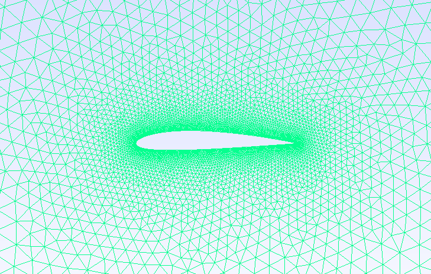

# Airfoil Mesher

A simple python script capable of automatically creating meshes of basic airfoil geometries.

Note how more advanced, and more efficient codes with the same purpose already exist. This code is purely a means for myself to practice my coding skills as well as create a really basic utility for my own purposes.

---

## Required libraries

The required python libraries are as follows

```bash
    pip install gmsh
    pip install matplotlib
    pip install numpy
    pip install argparse
```

---

## User guide

The codes main functionality is creating meshes of airfoil geometries. For now this is limited to the NACA 4 digit series, more airfoil geometries might be added later if required. 

The meshing of the airfoil geometry currently has two options

1. Creating unstructured grids using GMSH automatic mesh generation
2. Creating an O-grid using elliptical grid generation

The default behaviour of the solver creates an unstructured grid generated by GMSH using a NACA0012 airfoil geometry and can be called using

```bash
    python3 AirfoilMesher.py 
```

Additional options are available which can be viewed using 
```bash
    python3 AirfoilMesher.py --help
```

These options include:
```bash
    --NACA  followed by the digits of the corresponding airfoil
    --meshingMethod followed by either elliptic or gmsh
    --nodeSpacing followed by either uniform, cosLE, or cosLETE to define the node concentration along the airfoil
    --Nc followed by the amount of circumferential nodes defining the airfoil 
    --Nr followed by the amount of radial points, only used by elliptic grid generation
```

Per example, the code could be called as follows:

To call the code and create an unstructured grid of a NACA-2412 airfoil, using node clustering near the leading- and trailing edges, the following command can be used

```bash
    python3 AirfoilMesher.py --NACA 2412 --meshingMethod gmsh --nodeSpacing coslete
```

To create a structured O-grid of the same geometry, using the default number of circumferential and radial nodes, the following command can be used

```bash
    python3 AirfoilMesher.py --NACA 2412 --meshingMethod elliptic
```

To access specific meshing options such as the element size or the meshing algorithm, please see the corresponding python code files themselves. For future work this might be added as command line arguments.

For both meshing options, the GMSH FLTK GUI is opened upon finishing mesh generation. In this way, additional mesh manipulation through this GUI is available as well as saving the completed mesh to different output formats courtesy of GMSH.

---

## Examples

Some examples to show the functionality of either unstructured grids or ellipticaly generated grids are shown here.


*Figure 1: Structured mesh of the NACA-2412 airfoil generated using elliptical equations.*



*Figure 2: Structured mesh of the NACA-2412 airfoil generated using elliptical equations, zoomed in near airfoil*




*Figure 3: Unstructured mesh of the NACA-2412 airfoil generated using GMSH.*



*Figure 4: Unstructured mesh of the NACA-2412 airfoil generated using GMSH*


